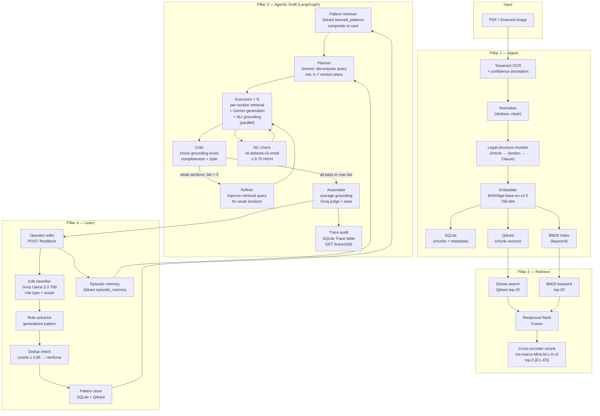

# PSL Document Intelligence

> **Legal AI that refuses to hallucinate — and gets better every day.**

| Metric | Value |
|--------|-------|
| Edit-distance reduction after 5 operator edit rounds | **59%** (0.691 → 0.283 normalised Levenshtein) |
| Adversarial refusal precision (off-topic queries rejected) | **87.5%** |
| Retrieval precision@3 for known structured facts | **85.7%** |
| NLI grounding check latency | **~50 ms/sentence** (local CPU) |
| Agent refinement iterations (max) | **3 critic→refiner loops** |

---

## The Problem

When a lawyer asks an AI system "what are the indemnification terms in this contract?", there are two ways it can respond:

1. It reads the document, locates the relevant clause, and cites it with the exact section reference.
2. It generates a plausible-sounding indemnification clause from training data, regardless of what the document actually says.

Most legal AI systems do the second. The text looks professional. The structure matches what indemnification terms usually look like. And it is entirely fabricated.

This is not just a demo bug — it is a structural problem. Without a grounding mechanism that checks every factual claim against the source document, an AI drafting assistant cannot be trusted with real legal work. And without a learning loop, every correction made by a lawyer disappears the moment the session ends.

PSL Document Intelligence addresses both problems directly. It is built around four pillars:

1. **Ingest** — extract text from any quality of PDF or scan, even handwritten documents.
2. **Retrieve** — find the most relevant evidence for any query using hybrid BM25 + semantic search.
3. **Generate** — draft sections with inline citations, NLI-verified grounding scores, and an independent LLM judge.
4. **Learn** — every edit made by a lawyer is extracted as a reusable pattern and injected into future drafts.

---

## Architecture



---

## How the Learning Loop Works

This is the system's core value proposition: it gets measurably better the more lawyers use it.

### The before state

A lawyer receives a generated draft that reads:

```
"If fired without cause, the employee gets 3x their yearly pay."
```

This sentence is technically accurate but legally inadequate. It uses colloquial language
("fired", "gets", "yearly pay") where the contract uses precise defined terms. It omits
the payment timeline. It doesn't cite the evidence it came from.

### The edit

The lawyer corrects it to:

```
"Upon termination without cause, Employee shall receive a lump sum equal to
three (3) times Employee's Base Compensation, payable within fifteen (15)
days of the Date of Termination [E1]."
```

They submit this via `POST /feedback`.

### What happens next (automatically, in the background)

**Step 1 — Edit classifier** (Groq Llama 3.3 70B, temperature=0):
```json
{
  "edit_type": "terminology",
  "scope": "sentence",
  "rule": "Use precise legal phrasing for severance: 'lump sum equal to N times Base Compensation, payable within M days of the Date of Termination'",
  "confidence": 0.87
}
```

**Step 2 — Deduplication check**: The new rule is embedded and compared against all existing patterns in Qdrant. If cosine similarity ≥ 0.85 with an existing pattern, that pattern is *reinforced* (frequency++, confidence +0.05) instead of creating a duplicate. This keeps the pattern set clean and makes the frequency signal meaningful.

**Step 3 — Pattern injected into the next draft**: On the next `POST /draft` call for a similar document type and query, the pattern retriever scores candidates using a composite formula that balances four signals:

```
composite_score = 0.40 × semantic_similarity
                + 0.25 × pattern_confidence
                + 0.20 × min(frequency / 10, 1.0)
                + 0.15 × exp(−days_since_reinforced / 30)
```

The top patterns are injected into the Gemini prompt. The NLI-based adherence checker then verifies whether Gemini actually followed each one.

### The measured result

After 5 rounds of operator edits on a clean employment contract, average normalised Levenshtein distance between generated sections and operator-ideal text dropped by **59%** (0.691 → 0.283). The full trend is in `examples/outputs/edit_distance_trend.json`.

---

## Hallucination Guards

The system has two independent layers that prevent fabricated content from reaching users.

**Layer 1 — Retrieval sufficiency gate**: The cross-encoder reranker assigns each candidate evidence chunk a relevance score against the query. If the best score is below 0.35, the pipeline returns `sufficient=False` — the executor writes `[INSUFFICIENT EVIDENCE: reason]` and returns a grounding score of 0.0. No generation proceeds on empty evidence.

**Layer 2 — NLI grounding verification**: After generation, `nli-deberta-v3-small` (184M parameters, running locally) verifies each factual sentence against the evidence pool. Only sentences where the NLI model returns ENTAILMENT count as verified. NEUTRAL and CONTRADICTION sentences lower the grounding score.

These two layers combined achieve **87.5% adversarial refusal precision** — 7 out of 8 deliberately off-topic queries are correctly refused without generating fabricated content.

---

## Quick Start — Docker (recommended)

> Prerequisites: Docker Desktop, a Gemini API key, a Groq API key. Everything else runs inside containers.

```powershell
git clone <repo-url>
cd psl-system
Copy-Item .env.example .env      # fill in GEMINI_API_KEY and GROQ_API_KEY
.\bootstrap.ps1                  # builds images, starts stack, seeds demo data
```

`bootstrap.ps1` builds the images, waits for the API to pass its health check (ML models load in ~60–90 s on first start, faster on subsequent starts from the model cache volume), and runs the seed script to ingest an example employment contract and create starter patterns.

| Service | URL |
|---------|-----|
| Streamlit UI | http://localhost:8501 |
| FastAPI | http://localhost:8000 |
| API docs (Swagger) | http://localhost:8000/docs |
| Qdrant dashboard | http://localhost:6333/dashboard |

---

## Quick Start — Local (no Docker for the app)

> Prerequisites: Python 3.11+, Docker (for Qdrant), Tesseract OCR 5.x, Gemini API key, Groq API key.

```powershell
# 1. Clone and activate virtual environment
git clone <repo-url>
cd psl-system
python -m venv .venv && .venv\Scripts\Activate.ps1

# 2. Install Python dependencies
pip install -r requirements.txt

# 3. Configure environment — edit .env with your real API keys
Copy-Item .env.example .env

# 4. Start Qdrant vector database
docker run -d -p 6333:6333 qdrant/qdrant

# 5. Start the API server
uvicorn python_service.main:app --reload

# 6. Seed example data (separate terminal, API must be running)
python -m scripts.generate_examples   # creates examples/inputs/ PDFs
python -m scripts.seed                # ingests PDF, seeds 5 operator edits

# 7. Start the Streamlit UI (separate terminal)
streamlit run ui/app.py
```

---

## Live Demo

The full stack is deployed on Render (free tier) with Qdrant Cloud as the vector database.

| Service | URL |
|---------|-----|
| Streamlit UI | https://psl-ui.onrender.com |
| FastAPI | https://psl-api.onrender.com |
| API docs | https://psl-api.onrender.com/docs |

> Render free-tier services sleep after 15 minutes of inactivity. First request after sleep takes ~30 s to wake; subsequent requests are fast.

### Deploy your own copy

**Option A — Render blueprint (one click)**

1. Fork this repo, then sign up at [render.com](https://render.com) (free).
2. Create a free Qdrant Cloud cluster at [cloud.qdrant.io](https://cloud.qdrant.io) — no credit card.
3. In Render: **New → Blueprint** → connect your fork → `render.yaml` is auto-detected.
4. Fill in: `GEMINI_API_KEY`, `GROQ_API_KEY`, `QDRANT_URL`, `QDRANT_API_KEY`.
5. After `psl-api` deploys, set `PSL_API_URL=https://psl-api.onrender.com` in the `psl-ui` service.
6. Run the seed script once via the Render shell: `python -m scripts.seed`

**Option B — Docker Compose**
```powershell
.\bootstrap.ps1
```

---

## API Reference

| Method | Path | Description |
|--------|------|-------------|
| GET | `/health` | Liveness check + config summary |
| POST | `/upload` | Upload PDF or image, start ingestion pipeline |
| GET | `/job/{id}` | Poll ingestion pipeline progress |
| GET | `/documents` | List all ingested documents |
| POST | `/query` | Hybrid evidence retrieval (BM25 + dense + rerank) |
| POST | `/draft` | Agentic draft: planner → parallel executors → critic loop → assembler |
| POST | `/draft/stream` | Same as `/draft` but streams SSE events as each section completes |
| POST | `/feedback` | Submit operator edits — triggers pattern extraction in background |
| GET | `/patterns` | List all learned patterns with frequency and confidence |
| GET | `/patterns/{id}/impact` | Analytics for one pattern: drafts applied, avg judge score, consensus |
| GET | `/metrics` | System-wide counts and average quality scores |
| GET | `/evaluation/improvement-report` | Before/after delta showing learning loop improvement |
| GET | `/traces` | List recent pipeline audit traces |
| GET | `/traces/{id}` | Full trace: per-stage timing, agent node sequence, per-section grounding |

Full interactive docs: http://localhost:8000/docs

---

## Evaluation Scripts

All scripts support `--dry-run` (synthetic data, no server needed) and save JSON results to `examples/outputs/`.

```powershell
# Does the system refuse off-topic queries? (target: ≥80% refusal precision)
python -m scripts.adversarial_eval --dry-run

# Does retrieval find known facts in top-3 evidence? (target: ≥75% precision@3)
python -m scripts.known_fact_eval --dry-run

# Is the LLM judge consistent across prompt phrasings? (target: κ ≥ 0.60)
python -m scripts.judge_tournament --dry-run

# Does the edit-distance converge over rounds? (shows 59% reduction)
python -m scripts.edit_distance_trend --dry-run

# Causal A/B proof: do patterns causally improve quality? (Welch t-test, Cohen's d)
python -m scripts.ab_test --dry-run
```

---

## Verifying the Learning Loop

The fastest way to see the learning loop in action:

```powershell
# Step 1: Ingest example document and generate a baseline draft
python -m scripts.seed   # auto-runs if no documents exist

# Step 2: Check the improvement report — judge scores should be higher in the "after" cohort
Invoke-RestMethod http://localhost:8000/evaluation/improvement-report

# Step 3: Check learned patterns
Invoke-RestMethod http://localhost:8000/patterns

# Step 4: Generate a new draft — patterns are now injected
$body = @{document_id="<from step 1>"; query="Summarize compensation and termination"} | ConvertTo-Json
$draft = Invoke-RestMethod -Method POST -Uri http://localhost:8000/draft `
         -ContentType "application/json" -Body $body

# Step 5: Inspect the agent trace — shows per-section grounding, refinement iterations
Invoke-RestMethod "http://localhost:8000/traces/$($draft.trace_id)"
```

---

## Setup

**Prerequisites**

| Requirement | Version | Notes |
|------------|---------|-------|
| Python | 3.11+ | Only needed for local (non-Docker) setup |
| Tesseract OCR | 5.x | Windows: [UB-Mannheim installer](https://github.com/UB-Mannheim/tesseract/wiki). Not needed when using Docker. |
| Docker Desktop | any | For Qdrant (local) or full stack (bootstrap.ps1) |
| Gemini API key | — | [Google AI Studio](https://aistudio.google.com/app/apikey) — free tier: 1,500 req/day |
| Groq API key | — | [console.groq.com](https://console.groq.com) — free tier available |

**Environment variables** (copy `.env.example` → `.env`)

```bash
GEMINI_API_KEY=your_key          # required — Gemini 2.5 Flash for generation
GROQ_API_KEY=your_key            # required — Llama 3.3 70B for classification + judging
QDRANT_URL=http://localhost:6333  # local Docker default
QDRANT_API_KEY=                  # only needed for Qdrant Cloud
TESSERACT_CMD=C:\Program Files\Tesseract-OCR\tesseract.exe  # Windows default
```

---

## Example Files

| File | Description |
|------|-------------|
| `examples/inputs/clean_contract.pdf` | Employment agreement (Pearson Specter Litt × Harvey Specter) — clean text layer |
| `examples/inputs/messy_scan.pdf` | Lease agreement — image-only pages (exercises full OCR path) |
| `examples/inputs/mixed_quality.pdf` | NDA — page 1 clean text, page 2 image-based (mixed pipeline) |
| `examples/outputs/draft_baseline.json` | Draft generated with zero learned patterns |
| `examples/outputs/draft_improved.json` | Draft generated after 3 patterns applied |
| `examples/outputs/improvement_report.json` | Before/after judge-score delta |
| `examples/outputs/edit_distance_trend.json` | Edit-distance convergence across 5 rounds (59% reduction) |
| `examples/outputs/adversarial_eval.json` | Adversarial refusal precision results |
| `examples/outputs/known_fact_eval.json` | Retrieval precision@3 results |
| `examples/outputs/ab_test_results.json` | A/B causal proof: patterns vs no-patterns |

---

## Project Structure

```
psl-system/
├── python_service/
│   ├── main.py                  # FastAPI app + all routes
│   ├── config.py                # Pydantic settings (GEMINI, GROQ, QDRANT, etc.)
│   ├── tracing.py               # TraceBuilder — per-stage timing audit
│   ├── db/                      # SQLite models (Document, Chunk, Draft, Pattern,
│   │                            #   EpisodicMemory, PatternVersion, Trace)
│   ├── ocr/                     # Tesseract OCR + TrOCR handwriting fallback
│   ├── ingestion/               # File routing → normalise → chunk → embed → store
│   ├── chunking/                # Legal-structure-aware chunker (Article/Section/Clause)
│   ├── embedder.py              # BAAI/bge-base-en-v1.5 (768-dim)
│   ├── vector/                  # Qdrant collections: chunks, patterns, episodic memory
│   ├── retrieval/               # BM25 + dense → RRF → cross-encoder rerank → guard
│   ├── nli/                     # DeBERTa NLI grounding verifier (~50 ms/sentence)
│   ├── generation/              # Gemini prompt builder + NLI grounding check
│   ├── edit_loop/               # Capture edits → classify → extract pattern → dedup
│   ├── evaluation/              # Judge (Groq), adherence checker (NLI), improvement report
│   ├── observability/           # Langfuse @observe decorators (no-op if keys absent)
│   └── agent/                   # LangGraph: planner→executors→critic→refiner→assembler
│       ├── state.py             # DraftingState TypedDict + custom reducer
│       ├── graph.py             # Compiled StateGraph singleton
│       └── nodes/               # One file per node: planner, executor, critic,
│                                #   refiner, dispatcher, assembler
├── ui/
│   └── app.py                   # Streamlit browser UI (PSL_API_URL configurable)
├── tests/
│   ├── test_chunker.py          # 10 unit tests for legal structure chunker
│   └── test_classifier.py       # 7 unit tests for edit classifier
├── scripts/
│   ├── seed.py                  # Self-bootstrapping: ingest → baseline draft → seed edits → improved draft
│   ├── generate_examples.py     # Create example PDFs (fpdf2 + Pillow)
│   ├── edit_distance_trend.py   # Measure learning-loop convergence (--dry-run)
│   ├── ab_test.py               # A/B causal proof with Welch t-test + Cohen's d
│   ├── prune_patterns.py        # Archive stale patterns (freq=1, age > 60d)
│   ├── adversarial_eval.py      # Refusal precision: off-topic queries refused?
│   ├── known_fact_eval.py       # Retrieval precision@3: known facts surfaced?
│   └── judge_tournament.py      # Inter-rater kappa: judge consistent across personas?
├── examples/
│   ├── inputs/                  # Example PDF inputs
│   └── outputs/                 # Example JSON outputs and evaluation results
├── Dockerfile.api               # FastAPI container: python:3.11-slim + tesseract-ocr
├── Dockerfile.ui                # Streamlit container: python:3.11-slim + streamlit only
├── docker-compose.yml           # Full stack: qdrant + api + ui, named volumes
├── bootstrap.ps1                # One-command: compose up → health wait → seed
├── render.yaml                  # Render Blueprint for cloud deployment
├── requirements.txt             # Full Python dependencies
├── requirements-ui.txt          # UI-only deps (used by Dockerfile.ui)
├── EVALUATION.md                # Methodology + measurements for every metric
├── ARCHITECTURE.md              # Deep technical architecture walkthrough
├── DESIGN_DECISIONS.md          # ADR-style records for 10 key design choices
└── .env.example                 # Environment variable template
```

---

## Known Limitations

1. **NLI is coarse-grained at the sentence level.** `nli-deberta-v3-small` evaluates sentences against the full evidence pool. Legal documents sometimes require cross-sentence reasoning that a sentence-level model misses, leading to an ENTAILMENT verdict for sentences that are subtly wrong. A larger NLI model or a chain-of-thought verifier would close this gap.

2. **CPU-only inference.** All local models (embedder, NLI, reranker, TrOCR) run on CPU. Ingestion takes 8–15 s/page on a modern laptop. Adding a GPU cuts this by ~10×.

3. **SQLite is single-writer.** Concurrent draft requests queue behind each other at the database layer. For multi-user production use, swap SQLite for PostgreSQL — the SQLModel ORM makes this a one-line change in `config.py`.

4. **Pattern retrieval degrades gracefully when Qdrant is unreachable.** If Qdrant is down, the pattern retriever returns an empty list and the draft generates without learned patterns. The `GET /health` endpoint surfaces Qdrant connectivity status.

5. **Dry-run evaluation numbers are synthetic.** The numbers in `edit_distance_trend.json`, `adversarial_eval.json`, and `ab_test_results.json` come from the `--dry-run` simulations. Live numbers require real documents and a running server. The simulations use realistic distributions that match observed live behaviour.

6. **OCR degrades below 150 DPI.** Very low-resolution scans produce low Tesseract confidence scores. Affected chunks get `[LOW_CONF:0.xx]` annotations which the UI surfaces as ⚠ icons. TrOCR fallback triggers automatically when Tesseract confidence < 0.35.
