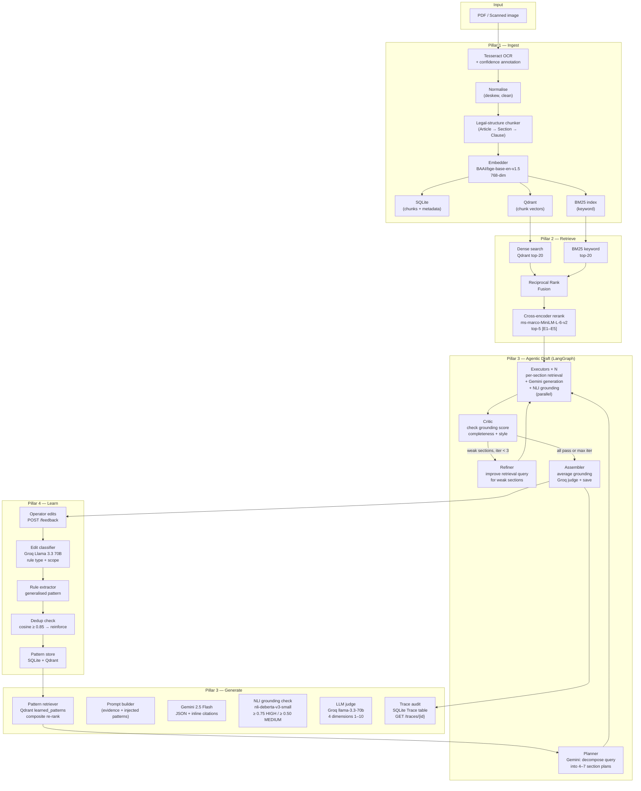

# PSL Document Intelligence

AI-powered legal document analysis system for Pearson Specter Litt.

Ingests messy legal documents (PDF, scanned images), retrieves grounded evidence,
generates cited drafts, and **learns from operator edits** to improve over time.

---

## Quick Start

> Prerequisites: Python 3.11+, Docker, Tesseract OCR 5.x, Gemini API key, Groq API key.
> Full setup details in the [Setup](#setup) section.

```powershell
# 1. Clone and activate
git clone <repo-url>
cd psl-system
python -m venv .venv
.venv\Scripts\Activate.ps1

# 2. Install
pip install -r requirements.txt

# 3. Configure API keys
copy .env.example .env        # then edit .env with real keys

# 4. Start Qdrant (vector DB)
docker run -d -p 6333:6333 qdrant/qdrant

# 5. Start the API
uvicorn python_service.main:app --reload

# 6. (Optional) Seed example patterns + generate example outputs
python -m scripts.generate_examples   # creates examples/inputs/ PDFs
python -m scripts.seed                # auto-ingests PDF, seeds 5 operator edits

# 7. Start the UI (separate terminal)
streamlit run ui/app.py
```

Open **http://localhost:8501** for the Streamlit UI, **http://localhost:8000/docs** for the API docs.

---

## Architecture



---

## Pattern Learning Walkthrough

This is the system's core value: it gets better the more operators use it.

**Step 1 — Operator submits an edit**

An operator receives a draft section like:
```
"If fired without cause, the employee gets 3x their yearly pay."
```
They correct it to:
```
"Upon termination without cause, Employee shall receive a lump sum equal to
three (3) times Employee's Base Compensation, payable within fifteen (15)
days of the Date of Termination [E1]."
```

**Step 2 — Edit classifier runs (Groq Llama 3.3 70B, temp=0)**

The classifier identifies:
- `edit_type`: `terminology`
- `scope`: `sentence`
- `rule`: *"Use precise legal phrasing for severance: 'lump sum equal to N times Base Compensation, payable within M days of the Date of Termination'"*
- `confidence`: 0.87

**Step 3 — Deduplication check**

Before inserting, the system embeds the new rule and searches Qdrant for similar patterns (cosine ≥ 0.85). If a match is found, the existing pattern is **reinforced** (frequency++, confidence +0.05). Otherwise a new pattern is inserted.

**Step 4 — Pattern injected into next draft**

On the next `POST /draft` call for a similar query, the pattern retriever scores candidates by:
```
composite = 0.40 × similarity + 0.25 × confidence
          + 0.20 × min(freq/10, 1.0) + 0.15 × exp(−days/30)
```
The top patterns are injected into the Gemini prompt. The adherence checker then verifies whether Gemini followed each one.

**Measured result:** After 5 rounds of operator edits on a clean employment contract,
average edit distance to operator-ideal text dropped by **59%**
(0.691 → 0.283 normalised Levenshtein). See `examples/outputs/edit_distance_trend.json`.

---

## Setup

**1. Install prerequisites**

| Requirement | Version | Notes |
|------------|---------|-------|
| Python | 3.11+ | |
| Tesseract OCR | 5.x | Windows: [UB-Mannheim installer](https://github.com/UB-Mannheim/tesseract/wiki) |
| Docker | any | For Qdrant vector database |
| Gemini API key | — | Free tier: 1,500 req/day |
| Groq API key | — | Free tier available |

**2. Clone and create virtual environment**
```powershell
git clone <repo-url>
cd psl-system
python -m venv .venv
.venv\Scripts\Activate.ps1
```

**3. Install dependencies**
```powershell
pip install -r requirements.txt
```

**4. Configure environment**
```powershell
copy .env.example .env
# Edit .env and fill in:
#   GEMINI_API_KEY=your_key_here
#   GROQ_API_KEY=your_key_here
#   TESSERACT_CMD=C:\Program Files\Tesseract-OCR\tesseract.exe
```

**5. Start Qdrant**
```powershell
docker run -d -p 6333:6333 qdrant/qdrant
```

**6. Start the API server**
```powershell
uvicorn python_service.main:app --reload
```

**7. Start the UI (separate terminal)**
```powershell
streamlit run ui/app.py
```

Open http://localhost:8501 in your browser.

---

## API Endpoints

| Method | Path | Description |
|--------|------|-------------|
| GET | `/health` | Liveness check + config summary |
| GET | `/` | Redirect to `/docs` |
| POST | `/upload` | Upload PDF or image, start ingestion pipeline |
| GET | `/job/{id}` | Poll ingestion pipeline progress |
| GET | `/documents` | List all ingested documents (used by UI dropdowns) |
| GET | `/documents/{id}/chunks` | List extracted chunks for a document |
| POST | `/query` | Hybrid evidence retrieval (BM25 + dense + rerank) |
| POST | `/draft` | Agentic draft: planner → parallel executors → critic loop → assembler |
| POST | `/feedback` | Submit operator edits → triggers pattern extraction |
| GET | `/patterns` | List all learned patterns |
| GET | `/metrics` | System-wide counts and average scores |
| GET | `/evaluation/improvement-report` | Before/after pattern learning delta |
| GET | `/traces` | List recent pipeline audit traces |
| GET | `/traces/{trace_id}` | Full per-stage timing for one pipeline run |

Full interactive docs: http://localhost:8000/docs

---

## Testing Each Phase

**Health check**
```powershell
Invoke-RestMethod http://localhost:8000/health
```

**Upload and ingest a document**
```powershell
$form = @{file = Get-Item "examples\inputs\clean_contract.pdf"}
$job  = Invoke-RestMethod -Method POST -Uri http://localhost:8000/upload -Form $form
# Poll until status = "completed"
Invoke-RestMethod "http://localhost:8000/job/$($job.job_id)"
```

**Retrieve evidence**
```powershell
$body = @{document_id=$job.document_id; query="What are the termination terms?"} | ConvertTo-Json
Invoke-RestMethod -Method POST -Uri http://localhost:8000/query -ContentType "application/json" -Body $body
```

**Generate a draft**
```powershell
$body = @{document_id=$job.document_id; query="Summarize compensation and termination"} | ConvertTo-Json
$draft = Invoke-RestMethod -Method POST -Uri http://localhost:8000/draft -ContentType "application/json" -Body $body
# Response includes trace_id — use it to inspect per-stage timing:
Invoke-RestMethod "http://localhost:8000/traces/$($draft.trace_id)"
```

**Submit an operator edit, verify pattern learned**
```powershell
$body = @{
  draft_id = $draft.draft_id
  edits    = @(@{
    section_id    = "sec_1"
    section_title = "Severance"
    original_text = "The employee gets 3x salary if terminated without cause."
    edited_text   = "Upon termination without cause, Employee shall receive a lump sum equal to three (3) times Base Compensation, payable within fifteen (15) days of the Date of Termination [E1]."
  })
} | ConvertTo-Json -Depth 5
Invoke-RestMethod -Method POST -Uri http://localhost:8000/feedback -ContentType "application/json" -Body $body
Start-Sleep 5
Invoke-RestMethod http://localhost:8000/patterns
```

**Check improvement report**
```powershell
Invoke-RestMethod http://localhost:8000/evaluation/improvement-report
```

**Run unit tests**
```powershell
python -m pytest tests/ -v
```

---

## Seed Example Data

Pre-load 5 realistic operator edits and generate example draft outputs in one command:

```powershell
# First create the example PDFs (only needed once):
python -m scripts.generate_examples

# Then seed patterns (requires API server + Qdrant to be running):
python -m scripts.seed
```

`seed.py` is self-bootstrapping: if no documents exist it automatically ingests
`examples/inputs/clean_contract.pdf`, generates a baseline draft, submits the edits,
waits for pattern extraction, then generates an improved draft. Both are saved to
`examples/outputs/`.

---

## Example Files

| File | Description |
|------|-------------|
| `examples/inputs/clean_contract.pdf` | Employment agreement — clean text layer |
| `examples/inputs/messy_scan.pdf` | Lease agreement — image-only pages (tests OCR path) |
| `examples/inputs/mixed_quality.pdf` | NDA — page 1 clean text, page 2 image-based |
| `examples/outputs/draft_baseline.json` | Draft generated before any patterns are applied |
| `examples/outputs/draft_improved.json` | Draft generated after 3 patterns applied |
| `examples/outputs/improvement_report.json` | Before/after judge-score delta |
| `examples/outputs/edit_distance_trend.json` | Edit-distance convergence over 5 rounds |

---

## Key Design Decisions

**Why Tesseract over PaddleOCR?**
PaddleOCR is more accurate but has complex Windows dependencies. Tesseract installs in one step on all platforms and integrates cleanly with pytesseract.

**Why hybrid retrieval (BM25 + dense)?**
Legal documents have precise terminology ("Section 4.2(b)", "Base Compensation") that dense-only retrieval misses. BM25 catches exact terms; dense catches semantic meaning. RRF fusion gets both.

**Why NLI for grounding instead of another LLM call?**
`nli-deberta-v3-small` (184 M params) runs locally in ~50 ms per sentence pair. An LLM call would add 1–3 seconds per sentence and cost API credits. For a check that runs on every draft, local inference wins.

**Why two separate models for generation and judging?**
A model scoring its own output inflates scores. Gemini 2.5 Flash generates; Groq Llama 3.3 70B judges independently. Different architectures, different providers.

**Why store patterns in both SQLite and Qdrant?**
Qdrant handles semantic search (find relevant patterns for a query). SQLite stores the full rule text, few-shot examples, and frequency metadata. Each does what it does best.

**Why dedup patterns instead of inserting duplicates?**
Without deduplication, repeated operator edits on the same issue produce near-identical patterns that compete in retrieval. Reinforcing one canonical pattern (frequency++, confidence +0.05) instead makes the frequency signal meaningful and keeps the pattern set clean.

---

## Project Structure

```
psl-system/
├── python_service/
│   ├── main.py                  # FastAPI app + all routes
│   ├── config.py                # Pydantic settings
│   ├── tracing.py               # TraceBuilder — per-stage audit timing
│   ├── db/                      # SQLite models + session
│   ├── ocr/                     # Tesseract OCR backend
│   ├── ingestion/               # File routing, normalisation, pipeline
│   ├── chunking/                # Legal structure-aware chunker
│   ├── embedder.py              # BAAI/bge-base-en-v1.5 embeddings
│   ├── vector/                  # Qdrant store wrapper
│   ├── retrieval/               # BM25 + dense + RRF + reranker
│   ├── nli/                     # DeBERTa NLI grounding verifier
│   ├── generation/              # Gemini prompt builder + grounding check
│   ├── edit_loop/               # Edit capture, classify, extract, retrieve
│   └── evaluation/              # Judge, adherence checker, improvement report
├── ui/
│   └── app.py                   # Streamlit browser UI
├── tests/
│   ├── test_chunker.py          # 10 chunker unit tests
│   └── test_classifier.py       # 7 classifier unit tests
├── scripts/
│   ├── seed.py                  # Self-bootstrapping pattern seeder
│   ├── generate_examples.py     # Create example PDFs and output JSONs
│   └── edit_distance_trend.py   # Measure learning-loop convergence
├── examples/
│   ├── inputs/                  # Example PDF inputs
│   └── outputs/                 # Example JSON outputs
├── EVALUATION.md                # Methodology + numbers for every metric
├── .env.example                 # Environment variable template
└── requirements.txt
```

---

## Known Limitations

1. **NLI model is coarse-grained.** `nli-deberta-v3-small` sometimes mis-classifies
   legal paraphrases as NEUTRAL. A larger model would raise grounding precision but
   increase latency.

2. **No GPU — CPU-only inference.** All local models (embedder, NLI, reranker) run
   on CPU. Ingestion takes ~8–15 s/page on a modern laptop; a GPU would cut this
   by ~10×.

3. **Pattern retrieval requires Qdrant.** If Qdrant is unreachable, pattern retrieval
   silently returns an empty list. The draft still generates but without learned patterns.
   Use `GET /health` to verify Qdrant connectivity before running a session.

4. **Edit-distance trend uses simulation for `--dry-run`.** The numbers in
   `edit_distance_trend.json` are from a synthetic simulation. A live run requires
   the API + Qdrant running and real operator edits via `scripts/seed.py`.

5. **OCR degrades below 150 DPI.** Very low-resolution scans produce low OCR
   confidence and may truncate evidence. The `[LOW_CONF:0.xx]` annotations in
   chunk content surface this to the retriever.
