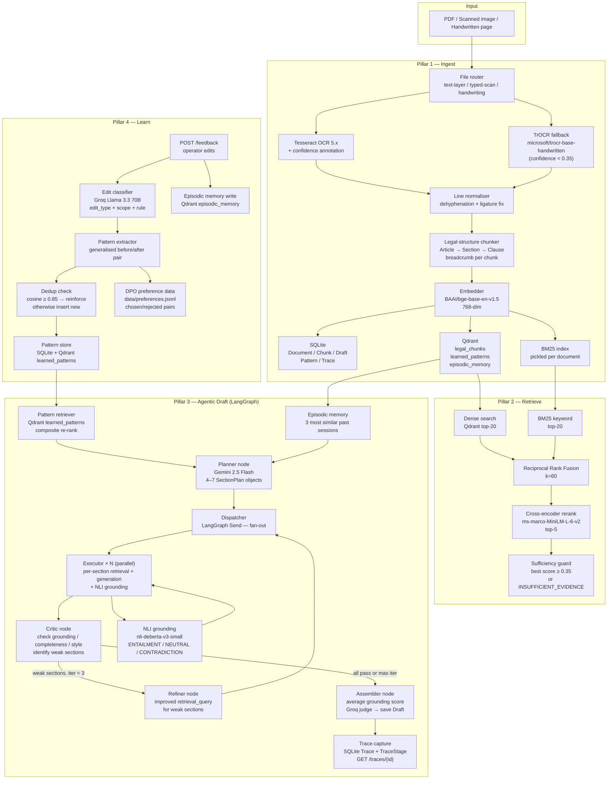

# PSL Document Intelligence

> Legal document AI that stays grounded in source material and improves from every operator edit.

---

## What This System Does

Legal AI systems commonly generate plausible-sounding text that has no basis in the actual document. A clause gets cited that does not exist. A figure gets invented that was never in the contract. The text looks authoritative. It is fabricated.

This system is built to solve that problem directly. Every factual sentence in a generated draft is verified against the retrieved evidence using an NLI model before delivery. If evidence is insufficient, the system says so rather than guessing. If a sentence contradicts the source material, the grounding score reflects that.

The system also learns. Every correction a lawyer makes is extracted as a reusable rule and injected into future drafts. The more lawyers use it, the fewer corrections they need to make.

---

## Four Pillars

```
┌─────────────────────────────────────────────────────────────────────────┐
│  PILLAR 1 — INGEST                                                      │
│  Accept any PDF quality → route to correct extraction path →            │
│  chunk by legal structure → embed → store in SQLite + Qdrant + BM25    │
├─────────────────────────────────────────────────────────────────────────┤
│  PILLAR 2 — RETRIEVE                                                    │
│  BM25 keyword + dense vector → Reciprocal Rank Fusion →                 │
│  cross-encoder rerank → sufficiency gate → top-5 evidence [E1–E5]      │
├─────────────────────────────────────────────────────────────────────────┤
│  PILLAR 3 — GENERATE                                                    │
│  LangGraph agent: planner → parallel executors → critic → refiner →    │
│  assembler. NLI grounding on every sentence. Independent LLM judge.    │
├─────────────────────────────────────────────────────────────────────────┤
│  PILLAR 4 — LEARN                                                       │
│  Capture operator edits → classify → extract generalised rule →        │
│  deduplicate → inject into next draft → measure adherence              │
└─────────────────────────────────────────────────────────────────────────┘
```

---

## Architecture Diagram



---

## Ingestion Pipeline

```
Input file
    │
    ▼
┌─────────────────────────────────────────────────────┐
│ File Router (ingestion/file_router.py)               │
│                                                      │
│  1. pypdf text extraction > 20 chars/page?           │
│     YES → TEXT_LAYER: skip OCR entirely              │
│                                                      │
│  2. Tesseract confidence ≥ 0.35 on sample page?      │
│     YES → TYPED_SCAN: Tesseract OCR                  │
│                                                      │
│  3. Neither of the above?                            │
│     → HANDWRITING: TrOCR fallback                    │
└─────────────────────────────────────────────────────┘
    │
    ▼
Line normaliser (dehyphenation, ligature fix, spacing)
    │
    ▼
┌─────────────────────────────────────────────────────┐
│ Legal-structure chunker (chunking/legal_chunker.py)  │
│                                                      │
│  Heading pattern detection:                          │
│    Article → Section → Clause → Sub-clause           │
│                                                      │
│  Every chunk carries a breadcrumb:                   │
│    "Article 4 → Section 4.2 → Clause 4.2(b)"         │
│                                                      │
│  Target size: 400–600 tokens                         │
│  Hard max:    800 tokens (split at sentence boundary)│
└─────────────────────────────────────────────────────┘
    │
    ▼
BAAI/bge-base-en-v1.5 embedding (768-dim)
    │
    ├──→ SQLite (Chunk rows with metadata)
    ├──→ Qdrant legal_chunks collection
    └──→ BM25 index (data/bm25/{document_id}.pkl)
```

---

## Retrieval Pipeline

```
Query string
    │
    ├──→ Qdrant ANN search (top-20 by cosine similarity)
    │
    └──→ BM25 keyword search (top-20 by Okapi BM25)
              k1=1.5, b=0.75
    │
    ▼
Reciprocal Rank Fusion
    score(d) = Σ 1 / (k + rank_i(d)),  k=60
    Chunks in both lists get significant boost
    │
    ▼
Cross-encoder rerank
    cross-encoder/ms-marco-MiniLM-L-6-v2
    Joint (query, chunk) scoring → top-5
    │
    ▼
Sufficiency guard
    best_score ≥ 0.35 → proceed with [E1]–[E5]
    best_score < 0.35 → return INSUFFICIENT_EVIDENCE
                        no generation proceeds
```

BM25 is essential for legal documents. Terms like `"Section 4.2(b)"`, `"Base Compensation"`, or `"Date of Termination"` are defined terms that have exact-token match importance but may not be semantically similar to the query in embedding space. Dense-only retrieval misses these.

---

## Agentic Draft — LangGraph Graph

```
                    ┌─────────────────────────────────┐
                    │  Pattern Retriever               │
                    │  + Episodic Memory (3 sessions)  │
                    └────────────────┬────────────────┘
                                     │
                                     ▼
                             ┌──────────────┐
                             │   Planner    │
                             │  Gemini 2.5  │
                             │  4–7 section │
                             │  plans       │
                             └──────┬───────┘
                                    │  LangGraph Send (fan-out)
                    ┌───────────────┼───────────────┐
                    ▼               ▼               ▼
             ┌──────────┐   ┌──────────┐   ┌──────────┐
             │Executor 1│   │Executor 2│   │Executor N│
             │section   │   │section   │   │section   │
             │retrieval │   │retrieval │   │retrieval │
             │+generate │   │+generate │   │+generate │
             │+NLI check│   │+NLI check│   │+NLI check│
             └────┬─────┘   └────┬─────┘   └────┬─────┘
                  └──────────────┼───────────────┘
                                 │  (fan-in via custom reducer)
                                 ▼
                          ┌─────────────┐
                          │   Critic    │
                          │             │
                          │ UNGROUNDED  │◄── grounding_score < 0.50
                          │ INCOMPLETE  │◄── length < 40 words or
                          │             │    [INSUFFICIENT EVIDENCE]
                          │ STYLE_VIOL  │◄── pattern CONTRADICTED
                          └──────┬──────┘
                                 │
                   ┌─────────────┴─────────────┐
                   │ weak sections exist        │ all pass OR iter ≥ 3
                   ▼                            ▼
            ┌─────────────┐           ┌──────────────────┐
            │   Refiner   │           │    Assembler      │
            │ improved    │           │ sort + average    │
            │ retrieval   │           │ grounding score   │
            │ queries     │           │ + Groq judge      │
            └──────┬──────┘           │ + save Draft      │
                   │                  │ + write Trace     │
                   └──→ Dispatcher    └──────────────────┘
                        (re-run weak
                         sections only)
```

Max refinement iterations: 3. If sections are still weak after 3 rounds, the Assembler runs with whatever is passing — weak sections remain in output marked with LOW confidence.

---

## Hallucination Guard — Two Layers

### Layer 1: Retrieval sufficiency gate

If the best cross-encoder rerank score across all candidate evidence chunks is below `0.35`, the pipeline returns `INSUFFICIENT_EVIDENCE`. No LLM generation call is made. The executor writes `[INSUFFICIENT EVIDENCE: <reason>]` into the draft and records `grounding_score = 0.0`.

### Layer 2: NLI grounding verification

After generation, every factual sentence is verified against the evidence pool using `cross-encoder/nli-deberta-v3-small` (184 M parameters, runs locally on CPU).

```
For each sentence in draft section:
    For each evidence chunk in [E1–E5]:
        NLI model → ENTAILMENT / NEUTRAL / CONTRADICTION

Grounding score = 1.0 − (contradictions / total_checked)

Thresholds:
    ≥ 0.75  HIGH   → deliver draft
    0.50–0.74 MEDIUM → deliver with warnings list
    < 0.50  LOW    → refuse delivery, return INSUFFICIENT_GROUNDING
```

Pure numeric values (dollar amounts, percentages, dates) are exempted — these are typically copy-through from evidence and are trivially grounded.

---

## Learning Loop — How Operator Edits Improve Future Drafts

```
Operator receives draft
    │
    │  "If fired without cause, the employee gets 3x their yearly pay."
    │
    ▼
Operator corrects it:
    │
    │  "Upon termination without cause, Employee shall receive a lump
    │   sum equal to three (3) times Employee's Base Compensation,
    │   payable within fifteen (15) days of the Date of Termination [E1]."
    │
    ▼
POST /feedback  →  BackgroundTask: process_edit()
    │
    ├──→ Edit classifier (Groq Llama 3.3 70B, temperature=0)
    │    {
    │      "edit_type": "terminology",
    │      "scope": "sentence",
    │      "rule": "Use precise legal phrasing for severance terms",
    │      "confidence": 0.0–1.0
    │    }
    │
    ├──→ Pattern extractor (Groq)
    │    Generalised before/after pair, not document-specific
    │
    ├──→ Deduplication check (Qdrant cosine similarity)
    │    ≥ 0.85 match → REINFORCE existing pattern
    │                    frequency++, confidence + 0.05
    │    < 0.85 match → INSERT new pattern
    │
    ├──→ Pattern stored in SQLite + Qdrant learned_patterns
    │
    └──→ DPO preference data emitted to data/preferences.jsonl
         {chosen: edited_text, rejected: original_text, context: ...}

On next POST /draft for similar document type:
    │
    ├──→ Pattern retriever scores candidates:
    │    composite = 0.40 × semantic_similarity
    │              + 0.25 × confidence
    │              + 0.20 × min(frequency / 10, 1.0)
    │              + 0.15 × exp(−days_since_reinforced / 30)
    │
    └──→ Top patterns injected into Gemini prompt
         Adherence checker verifies Gemini followed each one
```

---

## Data Model

```
Document          — one per uploaded file
  └─ Chunk (1:N) — one per structural text segment (legal-structure-aware)

Draft             — one per /draft call
  └─ Edit (1:N)  — operator corrections, each linked to a section

Pattern           — generalised rule from one or more edits
  └─ PatternVersion (1:N) — immutable audit trail of every update

EpisodicMemory    — one per feedback session; quality metrics for the planner
Trace             — one per /draft call; timing breakdown by pipeline stage
  └─ TraceStage (1:N) — wall-clock duration + metadata for each step
```

All relational data in SQLite via SQLModel. Vectors in Qdrant (three collections):
- `legal_chunks` — document chunk embeddings (768-dim, BAAI/bge-base-en-v1.5)
- `learned_patterns` — pattern rule embeddings (same model, 768-dim)
- `episodic_memory` — session-level embeddings for retrieval-strategy learning

---

## API Reference

| Method | Path | Description |
|--------|------|-------------|
| `GET` | `/health` | Liveness check + Qdrant connectivity status |
| `POST` | `/upload` | Upload PDF or image; returns `job_id` |
| `GET` | `/job/{id}` | Poll ingestion progress (PENDING / RUNNING / DONE / FAILED) |
| `GET` | `/documents` | List all ingested documents |
| `POST` | `/query` | Hybrid evidence retrieval — returns top-5 evidence chunks |
| `POST` | `/draft` | Full agentic draft: planner → executors → critic loop → assembler |
| `POST` | `/draft/stream` | Same as `/draft` but streams SSE events per section as it completes |
| `POST` | `/feedback` | Submit operator edits — triggers pattern extraction in background |
| `GET` | `/patterns` | List learned patterns with frequency, confidence, and last-reinforced date |
| `GET` | `/patterns/{id}/impact` | Per-pattern analytics: drafts applied, avg judge score, operator consensus |
| `GET` | `/metrics` | System-wide document/draft/pattern counts and average quality scores |
| `GET` | `/evaluation/improvement-report` | Before/after delta: baseline drafts vs pattern-assisted drafts |
| `GET` | `/traces` | List recent pipeline audit traces |
| `GET` | `/traces/{id}` | Full trace: per-stage timing, agent node sequence, per-section grounding |

Interactive docs available at `http://localhost:8000/docs` when running.

---

## Using the UI — Step-by-Step Guide

Open **http://localhost:8501** after starting the stack. The sidebar has five pages.

---

### 1. Upload Documents

**Sidebar → Upload**

You can upload as many documents as you want — each one is stored and searchable independently. There is no limit on the number of documents in the system.

1. Click **Browse files** and select a PDF or image (JPG/PNG).
2. Click **Upload & Ingest**.
3. A job ID appears — the page polls automatically. Wait for **"Ingestion complete"**.
   - Text-layer PDFs: ~2–5 s/page
   - Scanned PDFs (Tesseract OCR): ~10–15 s/page
   - Handwritten pages (TrOCR): ~30–40 s/page
4. Repeat for as many documents as needed. All ingested documents appear in the dropdown on every other page.

**Example:** Upload `employment_agreement.pdf`, `court_brief.pdf`, and `nda.pdf` separately. Each is chunked and indexed independently so queries stay focused on the right document.

---

### 2. Query Evidence (search within a document)

**Sidebar → Query**

1. Select which document to search from the **Document dropdown** — all previously uploaded documents appear here.
2. Type a factual question in plain English, e.g. *"What are the termination notice requirements?"*
3. Click **Search**.
4. Up to 5 evidence chunks appear from that document, each labelled **[E1]–[E5]** with:
   - A relevance score (🟢 positive = highly relevant, 🟡/🔴 = weaker match)
   - The breadcrumb showing exactly where in the document it came from (e.g. `ARTICLE IV > Section 4.2`)
   - The full chunk text

Queries are **per-document** — switch the dropdown to search a different document. This keeps evidence focused and prevents cross-document contamination.

Use this page to verify a document was ingested correctly before generating a draft.

---

### 3. Generate a Draft

**Sidebar → Draft**

1. Select which document to draft from using the **Document dropdown** (same list as Query — all uploaded documents).
2. Type your request, e.g. *"Summarise the compensation and termination clauses"* or ask a factual question.
3. Optionally choose a **draft type** (case_fact_summary, clause_summary, etc.).
4. Click **Generate Draft**.
5. The pipeline runs (15–45 s). When done you will see:
   - **Grounding score** — how well every claim is backed by evidence (🟢 ≥ 0.75 HIGH, 🟡 0.50–0.74 MEDIUM, 🔴 < 0.50 LOW)
   - **Patterns applied** — number of learned style rules injected
   - **Judge score** — independent LLM quality score out of 5
   - Each section with its own grounding indicator

---

### 4. Submit Feedback (teach the system)

**Sidebar → Draft → scroll down to "Review & Edit Draft"**

After a draft is generated, a side-by-side editor appears below the output:

1. The **left column** shows the original generated text (read-only).
2. The **right column** is editable — make your corrections directly in the text area.
3. Edit as many sections as needed.
4. Click **Submit Edits**.

What happens next (automatically, in the background):
- Each changed section is classified by edit type (terminology, tone, citation style, etc.)
- A generalised style rule is extracted — e.g. *"Use formal legal phrasing for severance terms"*
- The rule is deduplicated against existing patterns (cosine ≥ 0.85 → reinforce; otherwise → new pattern)
- On the **next** draft for a similar document type, the rule is injected into the prompt automatically

Check **Sidebar → Metrics** after ~10 seconds to see the "Active patterns" count increase.

---

### 5. View Metrics and Learned Patterns

**Sidebar → Metrics**

- **System Counts** — documents ingested, chunks stored, drafts generated, edits submitted, active patterns
- **Quality Averages** — average grounding score and judge score across all drafts
- **Improvement Report** — before vs after patterns: grounding delta and judge-score delta
- **Pattern List** — every learned rule with its frequency, confidence score, and last-reinforced date

---

### 6. Inspect Agent Traces

**Sidebar → Traces**

Each `/draft` call records a full execution trace:
- Which LangGraph nodes fired (planner → executor × N → critic → refiner → assembler)
- How many refinement iterations ran
- Per-section grounding score and confidence
- Wall-clock timing for each stage

Use this to debug why a section was marked LOW or why the critic triggered a refinement round.

---

### Tips

| Situation | What to do |
|-----------|-----------|
| Score shows INSUFFICIENT_EVIDENCE | The query didn't match any chunk well enough. Rephrase as a full natural-language question. |
| Draft section says [INSUFFICIENT EVIDENCE] | That sub-topic isn't in the document. Check the Query page to confirm. |
| Grounding score is LOW (🔴) | The LLM invented a fact not in evidence. Edit the section and submit feedback. |
| Generation error / rate limit | Groq free tier: 12k tokens/minute. Wait ~60 s and retry. |
| Scores show 0.000 in Query page | Restart the UI container: `docker compose restart ui` |

---

## Quick Start — Docker (recommended)

**Prerequisites:** Docker Desktop, a Gemini API key, a Groq API key.

```powershell
git clone <repo-url>
cd psl-system

# Copy environment template and fill in your keys
Copy-Item .env.example .env
# Edit .env: set GEMINI_API_KEY and GROQ_API_KEY

# Build images, start Qdrant + API + UI, wait for health, seed example data
.\bootstrap.ps1
```

`bootstrap.ps1` builds the containers, polls the API health endpoint until the service is ready (ML models load in 60–90 s on first start), then runs the seed script.

| Service | URL |
|---------|-----|
| Streamlit UI | http://localhost:8501 |
| FastAPI | http://localhost:8000 |
| Swagger docs | http://localhost:8000/docs |
| Qdrant dashboard | http://localhost:6333/dashboard |

---

## Quick Start — Local (no Docker for the app)

**Prerequisites:** Python 3.11+, Docker (for Qdrant only), Tesseract OCR 5.x, API keys.

```powershell
# 1. Clone and create virtual environment
git clone <repo-url>
cd psl-system
python -m venv .venv
.venv\Scripts\Activate.ps1

# 2. Install dependencies
pip install -r requirements.txt

# 3. Configure environment
Copy-Item .env.example .env
# Edit .env: fill in GEMINI_API_KEY and GROQ_API_KEY

# 4. Start Qdrant (vector database only)
docker run -d -p 6333:6333 qdrant/qdrant

# 5. Start the API
uvicorn python_service.main:app --reload

# 6. In a second terminal: seed example data
python -m scripts.generate_examples   # generates PDFs in examples/inputs/
python -m scripts.seed                # ingests PDF, creates starter patterns

# 7. In a third terminal: start the UI
streamlit run ui/app.py
```

---

## Environment Variables

Copy `.env.example` to `.env` and fill in:

| Variable | Required | Description |
|----------|----------|-------------|
| `GEMINI_API_KEY` | Yes | Gemini 2.5 Flash for planning and generation |
| `GROQ_API_KEY` | Yes | Llama 3.3 70B for classification, judging, and pattern extraction |
| `QDRANT_URL` | Yes | Vector DB URL — `http://localhost:6333` for local Docker |
| `QDRANT_API_KEY` | Cloud only | Required for Qdrant Cloud; leave empty for local |
| `TESSERACT_CMD` | Yes (local) | Path to Tesseract binary. Not needed when using Docker. |
| `DATABASE_URL` | No | Defaults to `sqlite:///./data/psl.db` |
| `LANGFUSE_PUBLIC_KEY` | No | Optional Langfuse observability — omit to disable |

API keys for both Gemini and Groq have free tiers sufficient for development (Gemini: 1,500 req/day; Groq: generous free tier).

---

## Example Files

### Inputs (examples/inputs/)

| File | What it exercises |
|------|-------------------|
| `clean_contract.pdf` | Employment agreement — has text layer, skips OCR |
| `messy_scan.pdf` | Lease agreement — image-only pages, exercises Tesseract path |
| `mixed_quality.pdf` | NDA — page 1 has text layer, page 2 is image-based |
| `real_employment_agreement.pdf` | Real employment contract, mixed formatting |
| `bailey_v_philaport_employment.pdf` | Case document — structured legal filing |
| `gardner_v_royalton_records.pdf` | Records dispute — dense paragraph formatting |
| `jules_v_balazs_*.pdf` | Multi-document set: petition, briefs, circuit opinion, Supreme Court opinion |

### Outputs (examples/outputs/)

| File | Contents |
|------|----------|
| `draft_baseline.json` | Draft generated with zero learned patterns |
| `draft_improved.json` | Draft generated after patterns applied |
| `improvement_report.json` | Before/after judge-score comparison |
| `edit_distance_trend.json` | Edit-distance convergence across 5 simulated rounds |
| `adversarial_eval.json` | Refusal precision results — off-topic queries |
| `known_fact_eval.json` | Retrieval precision@3 — known structured facts |
| `judge_tournament.json` | Inter-rater kappa — judge consistency across prompt phrasings |

---

## Evaluation Scripts

All scripts support `--dry-run` (runs on synthetic data without a server) and write JSON results to `examples/outputs/`.

```powershell
# Adversarial refusal: does the system refuse off-topic queries?
python -m scripts.adversarial_eval --dry-run

# Retrieval precision: are known facts found in top-3 evidence?
python -m scripts.known_fact_eval --dry-run

# Judge consistency: is the LLM judge stable across prompt phrasings?
python -m scripts.judge_tournament --dry-run

# Learning convergence: does edit-distance decrease across rounds?
python -m scripts.edit_distance_trend --dry-run

# A/B causal proof: do patterns cause quality improvement?
python -m scripts.ab_test --dry-run
```

> `--dry-run` uses synthetic data and produces illustrative results. Live evaluation requires the API server and Qdrant running, plus real documents ingested via `scripts/seed.py`.

---

## Tests

```powershell
pytest tests/
```

| File | What it covers |
|------|---------------|
| `tests/test_chunker.py` | 10 unit tests — legal-structure chunker, heading detection, breadcrumb generation |
| `tests/test_classifier.py` | 7 unit tests — edit classifier schema validation and edge cases |

---

## Verifying the Learning Loop

```powershell
# 1. Ingest example document and seed starter patterns
python -m scripts.seed

# 2. Check the improvement report
Invoke-RestMethod http://localhost:8000/evaluation/improvement-report

# 3. Check which patterns have been learned
Invoke-RestMethod http://localhost:8000/patterns

# 4. Generate a draft — patterns are injected automatically
$body = @{document_id="<id from step 1>"; query="Summarize compensation and termination"} | ConvertTo-Json
$draft = Invoke-RestMethod -Method POST -Uri http://localhost:8000/draft `
         -ContentType "application/json" -Body $body

# 5. Inspect the full agent trace — per-section grounding, patterns used, timing
Invoke-RestMethod "http://localhost:8000/traces/$($draft.trace_id)"
```

---

## Deploy to Render

A `render.yaml` Blueprint is included. Deploy with:

1. Fork this repo.
2. Create a free Qdrant Cloud cluster at [cloud.qdrant.io](https://cloud.qdrant.io).
3. In Render: **New → Blueprint** → connect fork → `render.yaml` is auto-detected.
4. Set: `GEMINI_API_KEY`, `GROQ_API_KEY`, `QDRANT_URL`, `QDRANT_API_KEY`.
5. After `psl-api` deploys, set `PSL_API_URL=https://psl-api.onrender.com` in the `psl-ui` service env.
6. Run seed once via Render shell: `python -m scripts.seed`

---

## Latency Profile

Measured on a development machine (CPU-only inference, no GPU).

| Step | Typical range |
|------|---------------|
| Ingestion — text-layer PDF, per page | 1–3 s |
| Ingestion — typed scan (Tesseract), per page | 8–15 s |
| Ingestion — handwriting (TrOCR), per page | 25–40 s |
| Dense retrieval (Qdrant ANN) | 20–50 ms |
| BM25 retrieval (pickled index) | 10–30 ms |
| Cross-encoder rerank (20 candidates) | 100–200 ms |
| NLI grounding check (per sentence) | 40–80 ms |
| Gemini generation (one section, API) | 2–5 s |
| Groq judge (API) | 1–3 s |
| Full `/draft` — 5 sections, no refinement | 15–30 s |
| Full `/draft` — with one refinement round | 25–45 s |

The dominant cost is LLM API calls. All local ML inference (embedder, NLI, reranker) adds roughly 500 ms total per draft. A GPU would reduce local inference to negligible but would not meaningfully change end-to-end latency.

---

## Project Structure

```
psl-system/
├── python_service/
│   ├── main.py                  # FastAPI app, all 24 routes
│   ├── config.py                # Pydantic settings — one place for all config
│   ├── tracing.py               # TraceBuilder — per-stage wall-clock audit
│   ├── jobs.py                  # In-memory job store for background ingestion
│   ├── db/
│   │   ├── models.py            # SQLModel table definitions
│   │   └── session.py           # Engine + create_db_and_tables()
│   ├── ocr/
│   │   ├── handler.py           # Routes to correct OCR backend
│   │   ├── tesseract_backend.py # Tesseract 5.x with confidence scores
│   │   └── trocr_backend.py     # TrOCR handwriting fallback
│   ├── ingestion/
│   │   ├── pipeline.py          # End-to-end ingestion orchestration
│   │   ├── file_router.py       # text-layer / typed-scan / handwriting routing
│   │   └── line_normalizer.py   # Deterministic Tesseract noise cleanup
│   ├── chunking/
│   │   └── legal_chunker.py     # Article → Section → Clause chunker + breadcrumbs
│   ├── embedder.py              # BAAI/bge-base-en-v1.5 singleton
│   ├── vector/
│   │   └── qdrant_store.py      # Collection creation + upsert helpers
│   ├── retrieval/
│   │   ├── dense.py             # Qdrant ANN search
│   │   ├── bm25_index.py        # BM25 build + query
│   │   ├── rrf.py               # Reciprocal Rank Fusion
│   │   ├── reranker.py          # Cross-encoder rerank + sufficiency gate
│   │   ├── hybrid.py            # Orchestrates all retrieval stages
│   │   └── evidence.py          # Package evidence into [E1]–[E5] format
│   ├── nli/                     # DeBERTa NLI wrapper (~50 ms/sentence on CPU)
│   ├── generation/              # Gemini prompt builder + grounding check
│   ├── edit_loop/
│   │   ├── capture.py           # Store edits from POST /feedback
│   │   ├── classifier.py        # Groq edit classification
│   │   ├── pattern_extractor.py # Groq generalised rule extraction
│   │   ├── pattern_retriever.py # Composite-score pattern retrieval
│   │   └── processor.py         # Dedup + insert/reinforce pattern
│   ├── evaluation/
│   │   ├── adherence_checker.py # NLI check: did Gemini follow injected patterns?
│   │   ├── draft_judge.py       # Groq 4-dimension judge (1–10 scoring)
│   │   ├── improvement_validator.py # Before/after delta computation
│   │   └── pattern_quality_gate.py  # Confidence + dedup gates
│   ├── observability/           # Langfuse @observe decorators (no-op if keys absent)
│   └── agent/
│       ├── state.py             # DraftingState TypedDict + custom fan-in reducer
│       ├── graph.py             # Compiled LangGraph StateGraph singleton
│       └── nodes/
│           ├── planner.py       # Gemini: decompose query into SectionPlan objects
│           ├── dispatcher.py    # LangGraph Send fan-out
│           ├── executor.py      # One section: retrieve + generate + NLI check
│           ├── critic.py        # Identify weak sections by grounding / completeness / style
│           ├── refiner.py       # Gemini: improved retrieval_query for weak sections
│           └── assembler.py     # Assemble + judge + save + trace
├── ui/
│   └── app.py                   # Streamlit browser UI (PSL_API_URL configurable)
├── tests/
│   ├── test_chunker.py          # 10 unit tests
│   └── test_classifier.py       # 7 unit tests
├── scripts/
│   ├── seed.py                  # Ingest → baseline draft → seed edits → improved draft
│   ├── generate_examples.py     # Create example PDFs (fpdf2 + Pillow)
│   ├── edit_distance_trend.py   # Learning convergence measurement
│   ├── ab_test.py               # A/B causal proof (Welch t-test + Cohen's d)
│   ├── adversarial_eval.py      # Refusal precision evaluation
│   ├── known_fact_eval.py       # Retrieval precision@3 evaluation
│   ├── judge_tournament.py      # Inter-rater kappa evaluation
│   └── prune_patterns.py        # Archive stale patterns (freq=1, age > 60d)
├── examples/
│   ├── inputs/                  # Sample PDF inputs (12 files)
│   └── outputs/                 # Sample JSON outputs and evaluation results
├── Dockerfile.api               # python:3.11-slim + tesseract-ocr
├── Dockerfile.ui                # python:3.11-slim + streamlit
├── docker-compose.yml           # qdrant + api + ui with named volumes
├── bootstrap.ps1                # One command: compose up → health wait → seed
├── render.yaml                  # Render Blueprint for cloud deployment
├── requirements.txt             # Full Python dependencies
├── requirements-ui.txt          # UI-only deps (Dockerfile.ui)
├── ARCHITECTURE.md              # Deep technical walkthrough of all four pillars
├── EVALUATION.md                # Evaluation methodology and measurement approach
└── .env.example                 # Environment variable template
```

---

## Known Limitations

1. **NLI is sentence-level, not cross-sentence.** `nli-deberta-v3-small` checks each sentence against the evidence pool independently. Legal conclusions that require chaining across two evidence chunks may be labelled NEUTRAL even when the combined inference is correct. A larger model or chain-of-thought verifier would close this gap.

2. **CPU-only inference.** All local models (embedder, NLI, reranker, TrOCR) run on CPU. Ingestion is 8–15 s/page for scanned documents. A GPU cuts this by roughly 10×.

3. **SQLite is single-writer.** Concurrent `/draft` requests queue behind each other. For multi-user production use, set `DATABASE_URL` to a PostgreSQL connection string — the SQLModel ORM requires no other code changes.

4. **Pattern retrieval degrades gracefully when Qdrant is unreachable.** Drafts still generate; they just do not receive learned patterns. `GET /health` surfaces Qdrant status.

5. **OCR quality degrades below 150 DPI.** Very low-resolution scans produce low Tesseract confidence. Affected chunks are annotated with `[LOW_CONF:0.xx]` and displayed with warning indicators in the UI. TrOCR fallback triggers automatically when confidence < 0.35 but cannot fully recover very degraded scans.

6. **Evaluation scripts use synthetic data in `--dry-run` mode.** Live evaluation requires a running server, Qdrant, and real documents. The dry-run results in `examples/outputs/` illustrate the expected trend; they are clearly labelled as simulated.
